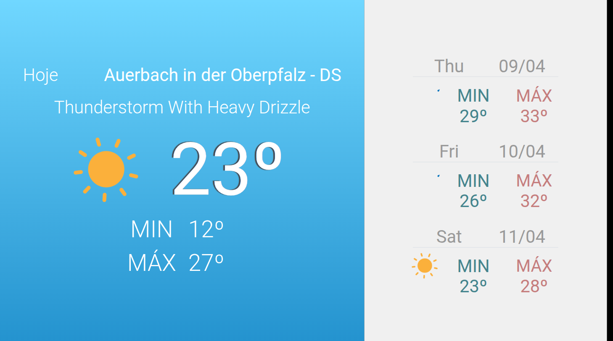
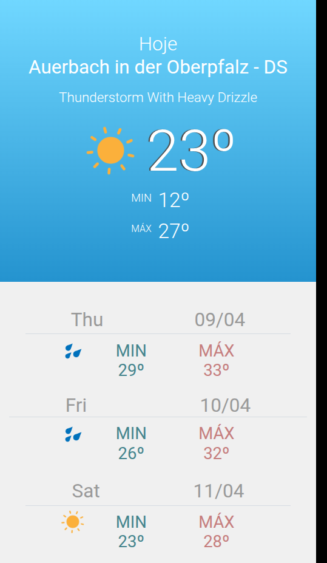
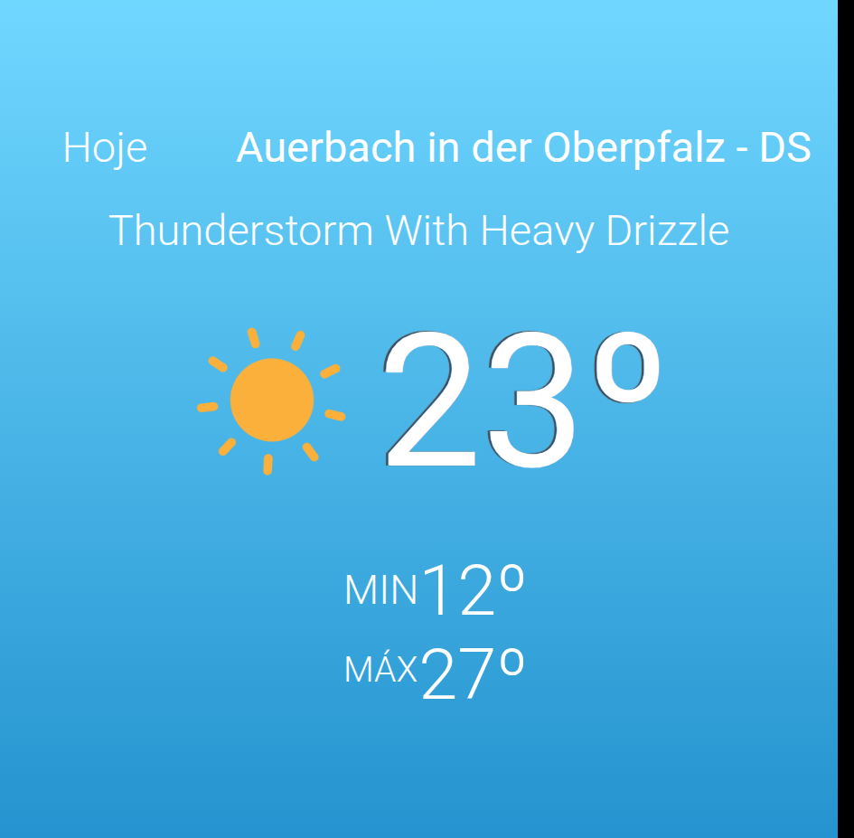

# DSPLAY - Weather Forecast Template

A [React](https://reactjs.org/) [HTML-based template](https://developers.dsplay.tv/docs/html-templates) for the [DSPLAY - Digital Signage](https://dsplay.tv/) platform, built for the **Weather Forecast** media type: shows current conditions plus a multi-day forecast, with day/night backgrounds and weather-condition icons/animations driven by the weather service's condition code.

> Built with [Vite](https://vitejs.dev/), requires Node.js 22.22.2+, 24.15.0+, or 26+ (see `.nvmrc`).

## Supported screen formats

| Landscape | Portrait | Square |
|-----------|----------|--------|
|  |  |  |

| Horizontal banner | Vertical banner |
|--------------------|-------------------|
|  |  |

> In square, horizontal-banner, and vertical-banner formats, the multi-day forecast column is intentionally hidden (`src/components/main/style.sass`) to leave room for the current-conditions panel; vertical banner additionally hides the city name and weather description to fit the narrow width.

## Template variables

| Key    | Type   | Default   | Description                                                        |
|--------|--------|-----------|----------------------------------------------------------------------|
| `unit` | string | `celsius` | Temperature unit to display: `celsius` or `fahrenheit`. Media values from the weather service are always in Celsius; `src/hooks/use-temperature.js` converts when `unit` is `fahrenheit`. |

> Remember to also register these as Template Vars (same name and type) when configuring this template in the DSPLAY CMS.

> New variable names should use `snake_case` (e.g. `background_color`, not `backgroundColor`) — the DSPLAY CMS Manager auto-generates each variable's label from its key, and snake_case reads more naturally there.

## Expected media data (`media.result`)

Unlike a generic custom template, this is a JSON-service-backed media type — `media.result` (see `src/components/main/index.jsx`) is populated by DSPLAY from an external weather service, with this shape:

```jsonc
{
  "validity": "2020-12-13T18:22:55.238Z",
  "showOutdated": true,
  "data": {
    "weather": {
      "city": "Auerbach in der Oberpfalz",
      "country": "DS",
      "current": {
        "code": 800,          // weather condition code, drives background + icon (see src/hooks/use-background.js, src/components/icon/index.jsx)
        "description": "Thunderstorm with heavy drizzle",
        "temp": 23.0,          // celsius
        "min": 12.0,
        "max": 27.0,
        "humidity": 78,
        "wind": 4.58,
        "date": "2020-07-27",
        "sunrise": "05:00",    // used to pick day vs night background/icon variants
        "sunset": "18:00"
      },
      "forecast": [
        { "code": 300, "description": "clear sky", "date": "2020-04-09", "min": 29.21, "max": 33.21 }
        // ... one entry per forecast day, rendered via src/components/forecast-item/index.jsx
      ]
    }
  }
}
```

`public/dsplay-data.js` has a full realistic example of this shape for local development, and is also what `template-example-data.json` captures for the CMS preview (see "Packing" below) — keep it in sync if this shape ever changes.

## Local development

```sh
npm install
npm start
```

`public/dsplay-data.js` defines `dsplay_config`/`dsplay_media`/`dsplay_template` mock globals used only when the template isn't running inside the actual DSPLAY app. Edit it to try out different weather conditions, units, or locales — the DSPLAY Player App replaces it with real content at runtime.

## Packing (release build)

```sh
npm run zip
```

This builds the template with Vite, which also generates `template-variables.json` + `template-example-data.json` (via [@dsplay/template-manifest](https://www.npmjs.com/package/@dsplay/template-manifest)'s Vite plugin) — the DSPLAY CMS reads these two files to auto-detect this template's variables and seed default preview values. It then generates `template.zip`, ready to be deployed to the [DSPLAY Web Manager](https://manager.dsplay.tv/template/create).

## Maintaining dependencies

Regular npm dependencies, not vendored files:

```sh
npm outdated   # see what has newer versions available
npm update     # bump within the ranges already declared in package.json
```

For a version outside the declared range (typically a major bump, e.g. a new [`@dsplay/react-template-utils`](https://github.com/dsplay/react-template-utils) or `moment` major), bump it deliberately in `package.json` and verify `npm start`, `npm run build`, and `npm test` still work before committing.

### Commit conventions

See [AGENTS.md](AGENTS.md).

## More

To see more about DSPLAY HTML Templates, visit: https://developers.dsplay.tv/docs/html-templates
